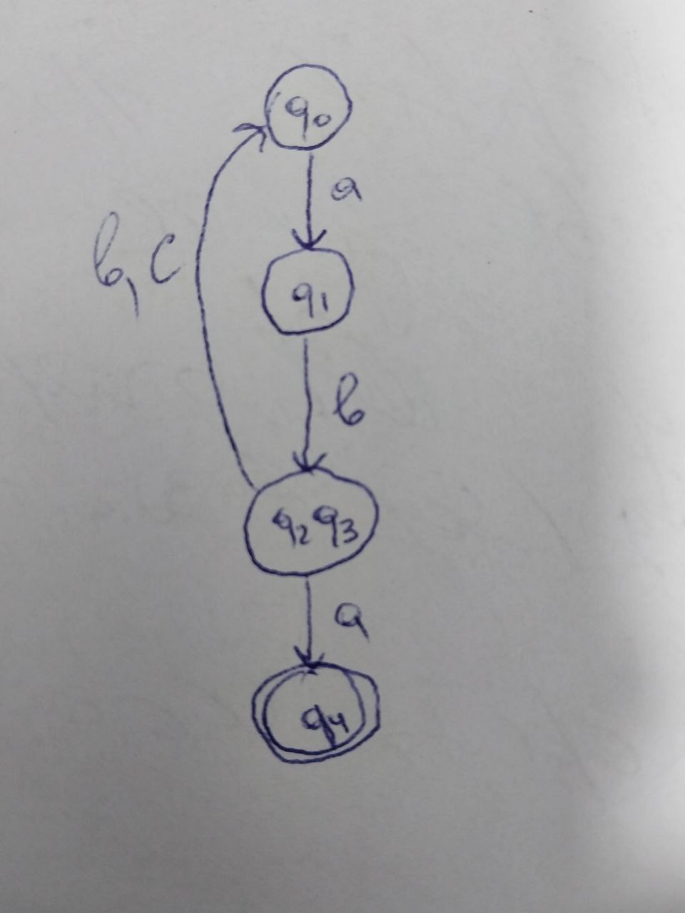

THEORY:

Grammar in the theory of automata computation is a finite set of formal rules that are generating syntactically correct sentences.

The formal definition of grammar is that it is defined as four tuples

G=(N, T, P, S), where

G is a grammar, which consists of a set of production rules. It is used to generate the strings of a language.
T is the final set of terminal symbols. It is denoted by lower case letters.
V is the final set of non-terminal symbols. It is denoted by capital letters.
P is a set of production rules, which is used for replacing non-terminal symbols (on the left side of production) in a string with other terminals (on the right side of production).
S is the start symbol used to derive the string.
Grammar is basically composed of two basic elements –

Terminal Symbols –
Terminal symbols are those which are the components of the sentences generated using grammar and are represented using small case letters like a, b, c, etc.
Non-Terminal Symbols –
Non-Terminal Symbols are those symbols that take part in the generation of the sentence but are not the component of the sentence. Non-Terminal Symbols are also called Auxiliary Symbols and Variables. These symbols are represented using capital letters like A, B, C, etc.


OBJECTIVES:

Understand what an automaton is and what it can be used for.

Continuing the work in the same repository and the same project, the following need to be added: a. Provide a function in your grammar type/class that could classify the grammar based on Chomsky hierarchy.

b. For this you can use the variant from the previous lab.

According to your variant number (by universal convention it is register ID), get the finite automaton definition and do the following tasks:

a. Implement conversion of a finite automaton to a regular grammar.

b. Determine whether your FA is deterministic or non-deterministic.

c. Implement some functionality that would convert an NDFA to a DFA.

d. Represent the finite automaton graphically (Optional, and can be considered as a bonus point):

You can use external libraries, tools or APIs to generate the figures/diagrams.

Your program needs to gather and send the data about the automaton and the lib/tool/API return the visual representation.


IMPLEMENTATION:

"FiniteAutomata" file:

The FiniteAutomaton class represents a finite automaton with states, alphabet, transitions, start state, and end state(s). The convert_to_regular_grammar method converts the finite automaton to a regular grammar, where each state corresponds to a non-terminal symbol and each transition corresponds to a production rule. The check_if_deterministic method checks if the finite automaton is deterministic by ensuring that each symbol in each state leads to at most one destination state.

In the convert_to_regular_grammar method, each state's transitions are examined, and for each symbol in the alphabet, corresponding rules are generated based on the destinations. If a symbol leads to multiple destinations, separate rules are generated for each destination.

In the check_if_deterministic method, it iterates over transitions and destinations to check if any symbol leads to more than one state, which indicates nondeterminism.

````
for state, rules in grammar.items():
    if rules:
        print(f"{state} -> {' | '.join(rules)}")
````

````
    def chomsky_hierarchy_classification(self):
        regular = True
        context_free = True
        context_sensitive = True
        for state, rules in self.convert_to_regular_grammar().items():
            for rule in rules:
                # Check if any rule contains more than two symbols or a terminal symbol alone
                if len(rule) > 2 or len(rule) == 1:
                    regular = False
                    context_free = False
                    context_sensitive = False
                    break
                elif len(rule) == 2:
                    if not rule[0].isupper() or not rule[1].isupper():
                        context_free = False
                        context_sensitive = False
                        break
                else:
                    if not rule.isupper():
                        context_sensitive = False
                        break
            if not regular and not context_free and not context_sensitive:
                break
````

Initialization: Three boolean variables regular, context_free, and context_sensitive are initialized to True. These variables will be used to track the classification of the grammar.

Iteration Over Rules: The method iterates over each state and its corresponding rules in the regular grammar generated from the finite automaton.

Rule Analysis:

For each rule:
If the length of the rule is greater than 2 or equal to 1, it means it cannot be a regular grammar. Thus, regular, context_free, and context_sensitive are set to False, breaking the loop.
If the length of the rule is 2, it checks whether both symbols in the rule are non-terminal (uppercase). If not, it means it cannot be a context-free grammar, and thus context_free and context_sensitive are set to False.
If the length of the rule is exactly 1 (a terminal symbol), it cannot be a context-sensitive grammar, so context_sensitive is set to False.
Breaking the Loop: If any of the classification checks fail (regular, context_free, or context_sensitive becomes False), the loop breaks early to save computation.

Classification: Finally, based on the values of context_sensitive, context_free, and regular, the method returns the appropriate classification of the grammar based on the Chomsky hierarchy.

"NDFAtoDFA" file:


The transformation method of DFA transforms an NFA into an equivalent DFA using the subset construction algorithm.

In the transformation method of the DFA class, the algorithm iterates through subsets of states of the NFA, determining the transition for each input symbol based on the epsilon closure of the current state. It then constructs the DFA's states and transitions accordingly.

````
while unprocessed_states:
    current_state = unprocessed_states.pop()
    if current_state not in self.states:
        self.states.add(current_state)
        for input_symbol in ndfa.alph:
            next_state = frozenset(
                [s for state in current_state for s in ndfa.transitions.get(state, {}).get(input_symbol, [])])
            if next_state:
                self.transitions[current_state, input_symbol] = next_state
                unprocessed_states.append(next_state)

````

Represent the finite automaton graphically:
